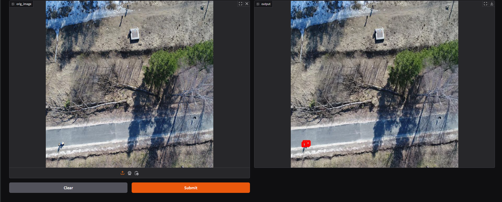

# Проект по нахождения людей на снимках с БПЛА для поиска пропавших без вести людей

Приложение представляет собой интерфейс на gradio, в котором на вход принимаются
изображения с БПЛА, происходит детекция с использованием модели RetinaNet, 
а на выходе изображение с размеченными людьми.

## Демонстрация 

---

Структура проекта:

- `models` - папка, в которой должны находится обученные модели (готовые веса можно скачать здесь https://drive.google.com/file/d/1wzLPXeeoIVNxXPWP-BCf-AwAQ0kpn7nt/view?usp=sharing) 
- `retina_model` - код для сборки модели RetinaNet
- `train_project` - здесь содержится код, который использовался для обучения и тестирования моделей**
- `app.py` - код интерфейса приложения

*~ Примечание ~*

- ** Обучение воспроизводилось на основе репозитория https://github.com/spmallick/learnopencv/tree/master/finetuning-retinanet
- В качестве данных для обучения использовался открытый датасет LADD https://datasetninja.com/lacmus-drone-dataset

## Инструкция по запуску 

---

0. *Рекомендуется скачать и установить Python версии 3.12.3*
1. В корне проекта создайте папку `models` (если ее нет) и поместите туда веса модели с названием *best_retina_model.pth*.
2. В командой строке перейдите в папку bpla_person_detection
3. Создайте новую виртуальную среду командой `python -m venv venv`
4. Активируйте виртуальную среду командой `./venv/Scripts/activate`
5. Установите зависимости `pip install -r requirements.txt`
6. Запустите проект `python app.py`
7. В браузере перейдите по ссылке http://127.0.0.1:7860/